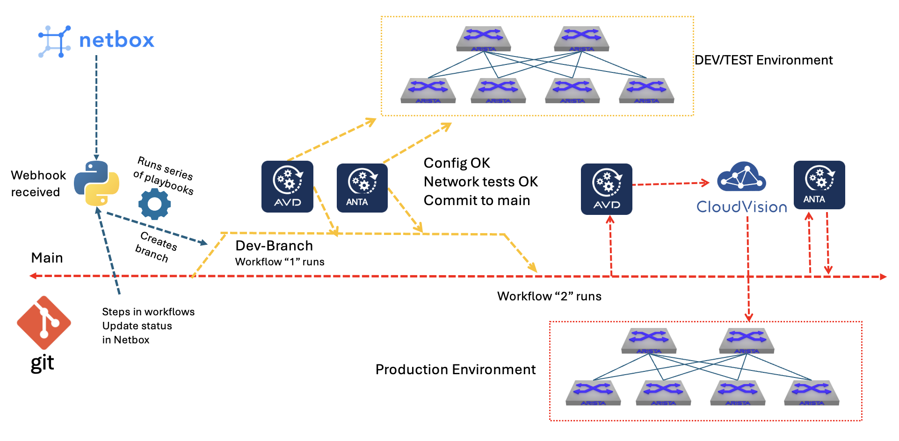

# My Netbox AVD pipeline demo

This repository contains the scripts, jinja templates, ansible playbooks and Netbox plugins I use in my CI pipeline demo showcasing Netbox and Arista Architect Validate Deploy working together.

This is not, by far, intended as a best practice approach, nor an offical approach from Arista. This is my own creation to just showcase how AVD and ANTA can be used as powerful tools in a CI pipeline in combination with tools such as Netbox, Git and Arista Cloudvision. I have also tried to keep the examples (group_var files etc) provided by AVD as "out-of-the-box" as possible from the AVD repo and keeping AVD as "unmodified" as possible to make it simpler to maintain and upgrade when new versions of AVD is released without adding too many "custom" scripts and playbooks that I need to revise if something is deprecated down the path. 

There are many ways to achieve such integrations and approaches which also cover much more details and logics. This is just my take on it to maybe inspire or getting the tought process started. 

Below I will briefly explain the different scripts, and how it is intended to work. 

## Requirements

To make this work there are some requirements. These will not cover the actual EOS devices and where those run except that they are ofcourse needed and may run as vEOS, cEOS or even physical instances. I am running two instances of Containerlab to simulate two environments of 10 EOS instances each where one is mye "dev-environment" and the second is my "production" environment.

In no particular order:

- Arista Architect Validate Deploy, pyAVD and AVD ansible collection (I am using the latest version as of this writing 5.7)
- ANTA
- Python
- Ansible
- Netbox - configured with an inventory, some required tags and labels (can be found looking in the scripts) 
- Arista Cloudvision
- Git (I am using Gitea hosted onprem and to handle my workflow/actions)
- Docker container as runner (I create and maintain my own runner that is kept updated according to AVD versions)
- EOS instances (dev and prod), I am hosting this on Containerlab
- A webhook receiver between Netbox, AVD and Gitea
- A linux machine to host the webhook receiver, access to git repository.
- Some of my own custom Netbox plugins (also provided in this repository)

## How my approach works

As I use Gitea and at the time I started creating this (many moons ago), Gitea did not support receiving webhooks. So I decided to just put some of that logic in a dedicated python script. This functions as a trigger to execute certain actions from specific events coming from Netbox and from Gitea. I have also provided the python script for this function in the repository. 

A short overview of whats happening. I have configured Netbox with labels, tags etc. When a "layer 2" vlan or and SVI (layer 3) is being created using my custom "vlan creator" script it notifies my webhook receiver to perform an action. This will trigger a couple of ansible playbook executed in serial in the right order. *I have also created a custom plugin that just send a generic "event" to my webhook receiver to start fetching update from Netbox.* 

After the ansible playbooks has run, if any changes are found it will create a branch in my git repository. This will trigger a workflow in that branch which involves running AVD and ANTA to generate new documentation and configuration from the changes made in Netbox and ANTA to perform network testing. This first workflow is only concering my dev environment. All the output will be committed and pushed to the same branch. I can review the changes then decide to merge this to my main branch. As soon as I do a pull request to main my next workflow will start. This will again run AVD to create documentation and configuration from the same change but now to my production environment. Not directly to the devices themselves, but to Arista CloudVision. 

**A note on what Netbox is responsible for in my demo:**

I have not focused on getting Netbox to provide all the configuration details such as BGP, VXLAN, EVPN config (full data model in Netbox). I have only focused on letting Netbox handle adding/removing devices, configure/add/remove interfaces, add/remove VLANs (including SVIs) and AVD will take care of the rest. There is ofcourse nothing stopping you to make Netbox handle everything if you want. 

## Webhook receiver tasks explained

As Gitea dont have or had this capability I decided to just run a simple python script ("/webhook_server/sync_netbox_avd_cvaas.py") that triggered certain actions when it received hooks from Netbox. These actions involves running 4 playbooks and a python script that reads the changes from Netbox. Below is a short description of what the responsibilities of the different playbooks do.

- 1-playbook-update_inventory-dev-prod.yml

This playbook is the first playbook that is being triggered and its responsibiliy is to update the AVD inventory.yml file from the actual content it fetches from Netbox. If I add a device in Netbox, it will update the inventory.yml to accommodate that. I decided that this approach will always keep the inventory.yml true to what is the actual devices in my Netbox. It will always be re-written if it detects a change, if no change is detected it will skip it.

The ansible playbook will call a python script (update_inventory.py) that does the fetching from Netbox using certain criterias. See the script for more details. The update_inventory.py script also generates the inventory.yml using the jinja template "inventory.yml.j2". 

The last task in the playbook it will also create a second and similar inventory.yml file called dev-inventory.yml for my dev-environment by replacing the content to reflect my dev inventory devices name, ip and fabric.

- 2-playbook-update_dc1_yml_according_to_inventory.yml

This playbook is the second playbook in the sequence and it responsiblity is to update the DC1.yml group_var file according to the actual device content. It is using the jinja template "update_dc1.j2". The DC1.yml file for the dev environment (DEV_DC1.yml) uses the dev-inventory.yml file to "generate" itself dynamically using jinja fields in the file itself. 

- 3-playbook-update_network_services.yml

This playbook is the third playbook in the sequence and its responsibility is to update the NETWORK_SERVICES.yml. This playbook will use ansible to fetch vlans, vrfs, interfaces matching certain criterias in Netbox (see playbook for more details) using Netbox's API. There is no need to have duplicate NETWORK_SERVICES.yml files to accomodate a dev and prod environment as they should be identical. It also uses the jinja template "network_services.j2"

- 4-playbook-update_connected_endpoints.yml

This playbook is the fourth and last playbook in the sequence and its responsibility is to update the CONNECTED_ENDPOINTS.yml file. This playbook also uses ansible to fetch the needed information from Netbox using Netbox API. See playbook for more information. There is no need to have duplicate CONNECTED_ENDPOINTS.yml files to accomodate a dev and prod environment as they should be identical. This playbook uses the jinja template "connected_endpoints.j2".

In addition to the above mentioned ansible playbooks the webhook script also perform actions like creating a branch if it detects any changes that indicates an update to any of the AVD related files above. When this branch has been committed and pushed it will trigger a workflow in my Gitea instance.  Read the webhook 

## Workflow tasks explained

In Gitea I have defined to workflow files under .gitea/workflows. 

- run_ansible_build.yaml

This workflow is triggered when there is created a branch. This will use my custom Gitea runner and will run the AVD ansible-playbook dev-build.yml to generate new config and documentation in that branch. Then it will run the AVD ansible-playbook dev-deploy.yml to push the config to the dev devices. It will also run the AVD playbook dev-anta.yml to run ANTA tests in the dev environments. The last AVD playbook dev-avd_cv_workflow.yml is run to reflect the changes in CloudVision (I have added my dev environment in CloudVision too).  Last tasks are updating the repo with the changes done from the playbooks above as they are executed from within the runner. 

Read the workflow for more details.

- run_ansible_build_deploy-cvp.yaml

This workflow is triggered as soon as something is merged into main. It will run the AVD playbook to generate documentaton and configurations for the prod environment. It will also update Netbox with a status of created on the vlan that has been created in Netbox. Then it will run the role cv_workflow role to deploy the config to Cloudvision while printing the Change Control ID that is being created in Cloudvision. This ID will be used by the script cv_monitor.py to subscribe to events from this CC job. As I have added this CC job as a manual step its been configured to do some retries before timing out. A note on this, the CC job being created should be automatically approved as it has already been validated in Git, but for demo purposes I have chosen to go for a manual step here. Yes, I know it breaks the automation. Even if I approve this automatically, Cloudvision will prevent if from running if Cloudvision find something it dont really like (not warning bit error in the config) The reason I fetch this CC id is because this is needed for my ANTA task that is supposed to only start if this CC job completes successfully. If the job completes successfully it will also Netbox to Applied. 

Read the workflow for more details.

## Gitea runner

If you dont want to create your own docker image for this purpose you can probably use mine hosted in my Docker registry:

"registry.guzware.net/avd/avd-5.7:v2"

